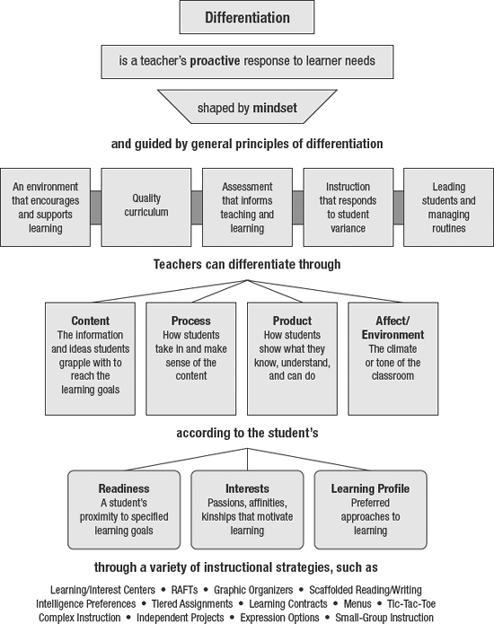

****
[Criteria 1](http://damienstpierre.com/criteria_1/)
[Criteria 2](http://damienstpierre.com/criteria_2/)
[Criteria 3](http://damienstpierre.com/criteria_3/)
[Criteria 4](http://damienstpierre.com/criteria_4/)
[Criteria 5](http://damienstpierre.com/criteria_5/)
[Criteria 6](http://damienstpierre.com/criteria_6/)
[Criteria 7](http://damienstpierre.com/criteria_7/)
[Criteria 8](http://damienstpierre.com/criteria_8/)
[Review](http://damienstpierre.com/criteria_review/)

****

**Importance of differentiation**

The literature on the importance and effect of differentiation on student
learning outcomes is strong.

-   Vygotsky’s (1978) definition of zone of proximal development laid the
    foundation for modern theories on differentiated learning; the ZPD is where
    the skills are too difficult to master on their own but can be achieved with
    the guidance of a more knowledgeable person.

-   Hattie (2012) details that differentiation is more about addressing
    students’ different phases of learning rather than just providing different
    activities for different students. A teacher must cater to the needs and
    phases of learning as a student progresses from novice to capable to
    proficient.

-   Tomlinson (Tomlinson, 2001) key elements of effective differentiation
    outline how teachers can differentiate through content, process, product and
    environment.

 Figure 1. *Key Elements of Effective Differentiation* (from Tomlinson & Moon, 2013) 

**Differentiating with Desmos**

Tomlinson’s (2001) categorisations of teacher’s ability to differentiate:

*Content*

-   Learning should result in student understanding of important content rather
    than largely rote memory of learning.

-   Desmos facilitates differentiation in multitude of ways. When used in a free
    form manner students are able to utilise tools, skills and knowledge at a
    level wholly suited to their ability. The classroom activities are produced
    by both practicing teachers and expert staff, all curated to ensure they are
    curriculum applicable yet accessible to all learners (Banting, McCormick,
    Twitchell, & Harvey, 2017).

*Process*

-   Students will be able to access different ‘paths’ to master and ‘own’ their
    knowledge, ideas and skills.

-   Desmos extensive array of learning activities allow the teacher and students
    choice in how and when they learn, based on interest and ability. Students
    are able to see recommended activities based on progress, skip ahead or
    repeat tasks as necessary. Furthermore, the multiple representations
    inherent to Desmos support students differing learning profiles.

*Product*

-   Students ability to show learning should not be constrained to one product
    or restrictive final piece of work.

-   ‘Desmos art’ as described by Banting et al. (2017) allows students to
    demonstrate understanding and skill with a variety of functions. The task is
    specifically designed so that no one solution or method is correct, allows a
    multitude of approaches and students can produce work related to personal
    interests. Desmos learning activities include live tracking enabling
    constant formative assessment by the teacher of student progress rather than
    relying on a single summative piece at the end of the unit. The learning
    activities are also specifically designed to allow for a variety of
    approaches/solutions.

*Affect*

-   Students should be able to operate in climate appropriate for learning that
    also encourages interactions among students and teachers.

-   Desmos learning activities are explicitly designed with real-time
    collaboration in mind, be it requiring students to work in assigned or
    random pairs/groups to complete tasks, sharing of solutions peer examplars
    and feedback components. The teachers, using the class management component
    can pause selective all students as required and highlight common
    misconceptions or correct process as needed (all while maintaining anonymity
    if so desired). Finally, students can access the material at any time and
    place of their choosing ensuring the are learning in an environment they
    feel comfortable.

**Untapped potential of Desmos to differentiate**

While I am comfortable with the standard Desmos graphing suite and using premade
activities I have no familiarity with the activity builder itself. As such there
are two powerful options for improved differentiation that have not been
described above:

-   Personally designed learning activities curated by myself taking into
    consideration my cohorts distinct contextual factors, learning needs and
    interests. This would allow for more precise and active differentiation
    (Orr, 2017) rather relying on pre made activities that might not best suite
    my students needs

-   Ability to scaffold students to create their own activities do demonstrate
    understanding (different product, process and content) (Gulati, 2017).

**Negative affordances of Desmos in relation to student needs**

As mentioned above, the planned usage of Desmos is dependant on a reliance on
premade learning activities. The primary userbase of Desmos resides in North
America and as such, language, conventions and material have strong North
American themes. An example would be a linear relations activity that while
extremely well designed for differentiation in content and process, utilising
imperial measurement unit. While this might offer an alternative learning
opportunity, it would increase cognitive load substantially and impede on the
desired learning outcomes related to the structure of linear relationships.

Furthermore, teachers need to be aware of the disparity between notation and
input students are familiar with and that require by Desmos. As Pierce, Stacey,
Wander, & Ball (2011) explained, difference in notation and input can
significantly impact students ability to demonstrate content and product
understanding due to a restriction in available processes (single use software).
As such, teachers need to be cognisant of these possible issues and
misconceptions, proactively addressing them and monitoring to ensure they are
not responsible for a reduction in the efficacy of using Desmos.

****
**References**

Banting, N., McCormick, K. K., Twitchell, G., & Harvey, S. (2017). Desmos Art.
*The Variable*, *2*(4), 25–28.

Gulati, S. (2017). Create your own interactive activity. *At Right Angles*,
*6*(3), 81–88.

Hattie, J. (2012). *Visible learning for teachers: Maximizing impact on
learning*. Routledge.

Orr, J. (2017). Function Transformations and the Desmos Activity Builder.
*Mathematics Teacher*, *110*(7), 549–551.

Tomlinson, C. A. (2001). *How to Differentiate Instruction in Mixed-Ability
Classrooms*. Alexandria: Pearson.

Tomlinson, C. A., & Moon, T. R. (2013). *Assessment and Student Success in a
Differentiated Classroom*. ASCD.

Vygotsky, L. S. (1978). *Mind in society: the development of higher
psychological processes*. (M. Cole, V. John-Steiner, S. Scribner, & E.
Souberman, Eds.). Harvard University Press.
