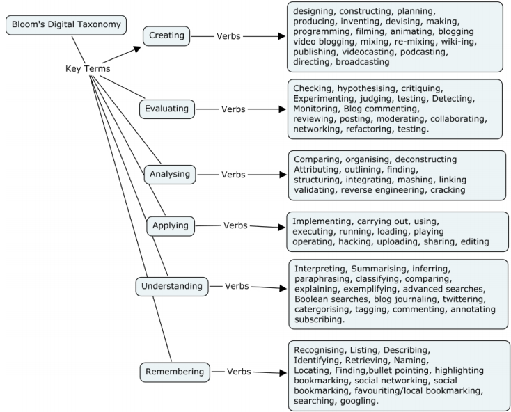
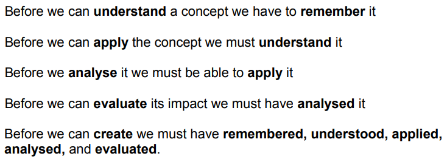

-------------------------------------------------------------------------------------------

**Classifying digital technology resources**

Blooms digital taxonomy (while hierarchical in nature – see criteria 2 for
concerns) (Churches, 2010) accounts for new behaviours, actions and
*opportunities* that have appeared in the 21st century with technological
advances. While Desmos is a highly recommended/preferred tool in literature
(Gulati, 2017; Liang, 2015; Montijo, 2018; Orr, 2017) Blooms taxonomy can be
used to assess the suitability and importantly flexibility of digital tools.

As described in criteria 3, providing different tasks is not effective
differentiation; being suitably attuned to students differing needs and
responding to them as required is. This means that not all instruction should be
focused on higher order thinking skills as learning is a process.

As such, Blooms digital taxonomy is useful in assessing the flexibility and
usefulness of a digital to **all learners** at **all stages of the learning.**
Below is a quick highlight of the strength and flexibility of just a single
Desmos learning activity against Blooms digital taxonomy.

**Linear Relations – Marbles learning activity**

Review – students must remember, recognise, name and highlight the components of
linear function and its graph **(Remembering).**

First Task – Experimentation with basic linear function transformations -
Students are required summarise and share with classmates (commenting within
Demsos) their interpretation of the components of a linear function and its
graph **(Understanding).**

Second Task – Students playing a challenge controlling the path of marbles using
linear graphs. Students are applying their knowledge of linear functions
executing function commands **(Apply).**

Third Task – Students are presented classmates solutions to the previous task
that they are to validate, critique and share feedback on (commenting within
Desmos) **(Analyse).**

Fourth Tasks – Working in pairs both students submit to each other solutions to
problems similar to task 2 (marble control). The students must review,
hypothesis if correct and then test for success. Afterwards the pairs must
collaborate and refactor their solutions together and submit one agreed upon
‘best solution’ **(Evaluating).**

Fifth Tasks – Students are to produce and image of their own choosing using
linear functions and publish to their classmates (Desmos class share)
**(Create).**

**Conclusion**

It is clear from the literature, and brief analysis against blooms digital
technology that Demsos is an incredibly flexible learning tool. It is suitable
for all learners (novice, capable and proficient) to help develop their
understanding of mathematical functions and their graphical representations.

----------------------------------------------------------------------------------------------------------

Churches, A. (2010). Bloom’s digital taxonomy. Australian School Library
Association NSW Incorporated.

Gulati, S. (2017). Create your own interactive activity. *At Right Angles*,
*6*(3), 81–88.

Liang, S. (2015). Teaching the Concept of Limit by Using Conceptual Conflict
Strategy and Desmos Graphing Calculator. *International Journal of Research in
Education and Science*, *2*(1), 35. https://doi.org/10.21890/ijres.62743

Montijo, E. (2018). *The effects of Desmos and TI-83 Plus graphing calculators
on the problem-solving confidence of middle and high school mathematics
students. Dissertation Abstracts International Section A: Humanities and Social
Sciences*. ProQuest Information & Learning. Retrieved from
http://search.ebscohost.com/login.aspx?direct=true&db=psyh&AN=2017-29361-010&site=ehost-live

Orr, J. (2017). Function Transformations and the Desmos Activity Builder.
*Mathematics Teacher*, *110*(7), 549–551.
